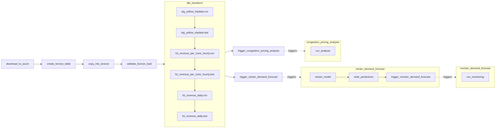

# NYC TLC Analytics Pipeline

End-to-end data engineering, ML, and BI pipeline for NYC Yellow Taxi data — from raw
Parquet ingestion through a Medallion lakehouse to LightGBM demand forecasting and
interactive Superset dashboards.

## Architecture

```
NYC TLC CDN (CloudFront)
        │  HTTPS download (no auth)
        ▼
Azure Blob Storage          ← Airflow downloads monthly Parquet files
        │  Snowflake External Stage (SAS token)
        ▼
Snowflake Bronze            ← COPY INTO, raw VARIANT, schema-on-read
        │  dbt (Silver)
        ▼
Snowflake Silver            ← Typed, deduplicated, data quality filters applied
        │  dbt (Gold)
        ▼
Snowflake Gold              ← Aggregated fact tables (hourly + daily grain)
        │                                    │                        │
        ▼                                    ▼                        ▼
Apache Superset             ← BI     LightGBM retrain      DiD causal inference
dashboards                           │  ← MLflow            (congestion pricing)
                                     ▼                        │
                             Snowflake ML schema    ←─────────┘
                               fct_demand_forecast
                               fct_congestion_pricing_impact
                               fct_model_monitoring  ← monitor_demand_forecast DAG
```

## Stack

| Layer | Technology |
|---|---|
| Orchestration | Apache Airflow 2.x (TaskFlow API, Docker Compose) |
| Storage | Azure Blob Storage + Snowflake (X-Small warehouse, Trial) |
| Transformation | dbt-core 1.8.7 + dbt-snowflake 1.8.4 |
| ML | LightGBM 4.5, statsmodels 0.14, MLflow 2.19 (experiment tracking + model registry) |
| Visualization | Apache Superset |
| CI | GitHub Actions (lint, DAG parse, dbt parse, ML import smoke test, Docker build) |

## Gold Layer Models

| Model | Grain | Primary use |
|---|---|---|
| `fct_revenue_per_zone_hourly` | pickup_hour × zone × vendor | Intraday demand patterns, vendor analysis |
| `fct_revenue_daily` | pickup_date × zone | Time-series trends, borough comparisons |

## ML Models

| Model | Output table | Schedule |
|---|---|---|
| LightGBM demand forecast | `ML.fct_demand_forecast` | Monthly, triggered after `dbt_transform` |
| DiD causal inference (congestion pricing) | `ML.fct_congestion_pricing_impact` | Monthly, triggered after `dbt_transform` (parallel with retrain) |
| Model monitoring & drift detection | `ML.fct_model_monitoring` | Monthly, triggered after `write_predictions` completes |

## Pipeline DAG



## Dashboards

**NYC TLC Yellow Taxi Analytics** — KPI scorecards, revenue and trip trends,
borough/vendor splits, demand heatmap (day × time of day), tip % by borough.


## Data Coverage

NYC Yellow Taxi trips · January 2024 – present · Source: [NYC TLC Open Data](https://www.nyc.gov/site/tlc/about/tlc-trip-record-data.page)

## Key Design Decisions

- [ADR-001](docs/adr/001-azure-blob-over-s3-direct.md) — Azure Blob over direct S3 access
- [ADR-002](docs/adr/002-gold-on-gold-daily-model.md) — Gold-on-Gold daily model
- [ADR-003](docs/adr/003-incremental-dbt-over-snowflake-streams.md) — Incremental dbt over Snowflake Streams
- [ADR-004](docs/adr/004-automate-azure-download-in-dag.md) — Automate Azure download inside the DAG
- [ADR-005](docs/adr/005-lightgbm-demand-forecasting.md) — LightGBM for demand forecasting
- [ADR-006](docs/adr/006-mlflow-experiment-tracker.md) — MLflow as experiment tracker and model registry
- [ADR-007](docs/adr/007-did-congestion-pricing-analysis.md) — Difference-in-differences OLS for congestion pricing impact estimation
- [ADR-009](docs/adr/009-model-monitoring-drift-detection.md) — Model monitoring and feature drift detection approach

## Running Locally

```bash
# 1. Copy and fill in credentials
cp .env.example .env

# 2. Start all services (Airflow, MLflow, Superset)
docker compose up -d

# 3. Trigger the ingestion DAG in Airflow UI
#    http://localhost:8080  (admin / admin)

# 4. Run dbt transformations
cd transform && dbt build --target dev --profiles-dir .

# 5. Open MLflow to review experiments and promote models
#    http://localhost:5000

# 6. Open Superset
#    http://localhost:8088  (admin / admin)
```

## Repository Structure

```
orchestration/   Airflow DAGs and dependencies
transform/       dbt project (Bronze source, Silver, Gold models)
ml/              ML feature engineering, model training, prediction scripts
infra/           Snowflake setup SQL, Azure bootstrap script, Dockerfiles
viz/superset/    Superset config and dashboard export
docs/            ADRs and engineering notes
```

## Roadmap

**Phases 6–9 complete.** MLOps infrastructure is live with full observability:
MLflow experiment tracking, monthly LightGBM retrain, DiD congestion pricing analysis,
and model monitoring with feature drift detection — all running in a sequential trigger
chain each month after `dbt_transform` completes, writing results to `NYC_TLC_DB.ML`.

**Future:**

- Superset monitoring dashboard (prediction error trend, drift flags, model version history)
- XGBoost, LSTM, TabNet forecasters (deferred to post-`main` branch)
