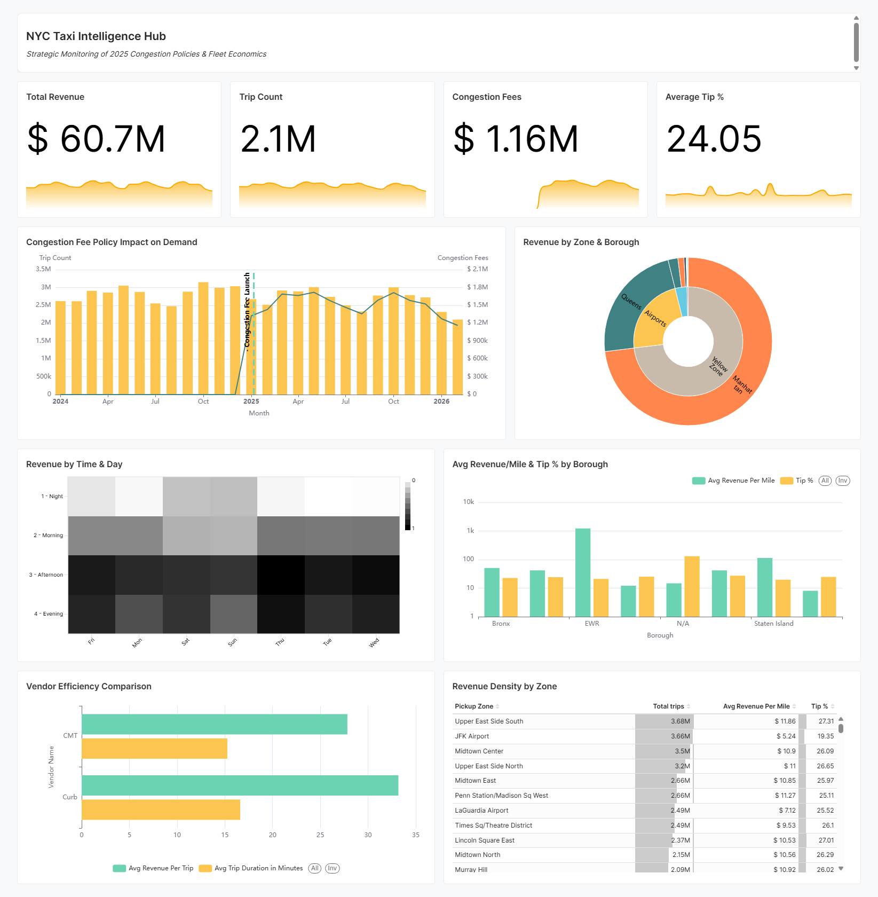
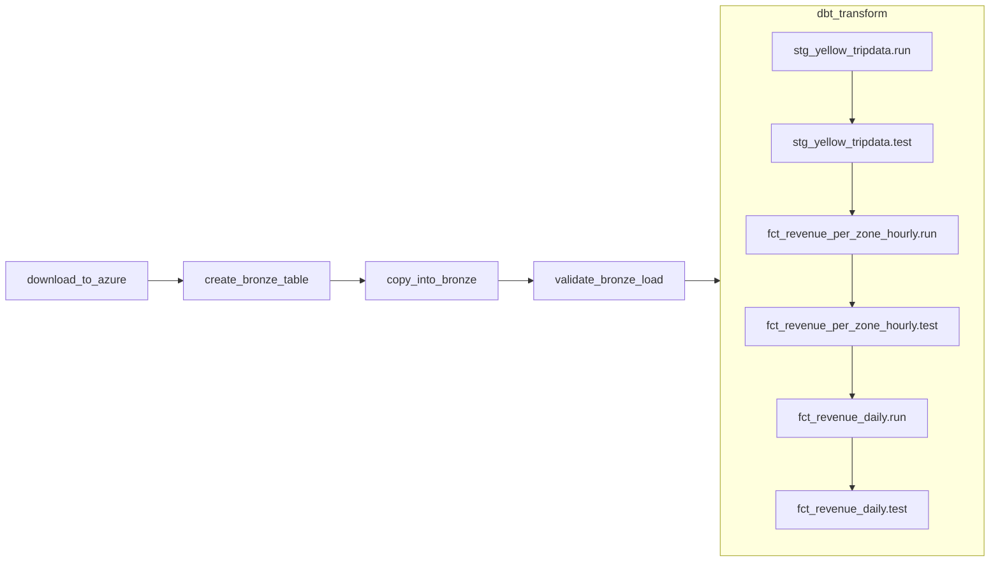

# NYC TLC Analytics Pipeline

End-to-end data engineering and BI pipeline for NYC Yellow Taxi data — from raw
Parquet ingestion through a Medallion lakehouse to interactive Superset dashboards.

## Architecture

```
NYC TLC CDN (CloudFront)
        │  HTTPS download (no auth)
        ▼
Azure Blob Storage          ← Airflow downloads monthly Parquet files
        │  Snowflake External Stage (SAS token)
        ▼
Snowflake Bronze            ← COPY INTO, raw VARIANT, schema-on-read
        │  dbt (Silver)
        ▼
Snowflake Silver            ← Typed, deduplicated, data quality filters applied
        │  dbt (Gold)
        ▼
Snowflake Gold              ← Aggregated fact tables (hourly + daily grain)
        │
        ▼
Apache Superset             ← Interactive BI dashboards
```

## Stack

| Layer | Technology |
|---|---|
| Orchestration | Apache Airflow 2.x (TaskFlow API, Docker Compose) |
| Storage | Azure Blob Storage + Snowflake (X-Small warehouse, Trial) |
| Transformation | dbt-core 1.8.7 + dbt-snowflake 1.8.4 |
| Visualization | Apache Superset |
| CI | GitHub Actions (lint, DAG parse, dbt parse, Docker build) |

## Gold Layer Models

| Model | Grain | Primary use |
|---|---|---|
| `fct_revenue_per_zone_hourly` | pickup_hour × zone × vendor | Intraday demand patterns, vendor analysis |
| `fct_revenue_daily` | pickup_date × zone | Time-series trends, borough comparisons |

## Dashboards

**NYC TLC Yellow Taxi Analytics** — KPI scorecards, revenue and trip trends,
borough/vendor splits, demand heatmap (day × time of day), tip % by borough.


## Pipeline DAG



## Data Coverage

NYC Yellow Taxi trips · January 2025 – present · Source: [NYC TLC Open Data](https://www.nyc.gov/site/tlc/about/tlc-trip-record-data.page)

## Key Design Decisions

- [ADR-001](docs/adr/001-azure-blob-over-s3-direct.md) — Azure Blob over direct S3 access
- [ADR-002](docs/adr/002-gold-on-gold-daily-model.md) — Gold-on-Gold daily model
- [ADR-003](docs/adr/003-incremental-dbt-over-snowflake-streams.md) — Incremental dbt over Snowflake Streams
- [ADR-004](docs/adr/004-automate-azure-download-in-dag.md) — Automate Azure download inside the DAG

## Running Locally

```bash
# 1. Copy and fill in credentials
cp .env.example .env

# 2. Start all services
docker compose up -d

# 3. Trigger the ingestion DAG in Airflow UI
#    http://localhost:8080  (admin / admin)

# 4. Run dbt transformations
cd transform && dbt build --target dev --profiles-dir .

# 5. Open Superset
#    http://localhost:8088  (admin / admin)
```

## Repository Structure

```
orchestration/   Airflow DAGs and dependencies
transform/       dbt project (Bronze source, Silver, Gold models)
infra/           Snowflake setup SQL, Azure bootstrap script, Dockerfiles
viz/superset/    Superset config and dashboard export
docs/            ADRs and engineering notes
```

## Roadmap

**Phase 2 — Machine Learning & MLOps**

Planned extensions using the Gold layer as a feature store:

- **Demand forecasting** — Temporal Fusion Transformer predicting hourly trip
  counts per zone; Airflow retraining DAG triggered monthly after dbt build
- **Anomaly detection** — Autoencoder flagging unusual demand/revenue patterns
  (events, weather, policy shocks)
- **Spatial demand modelling** — Graph Neural Network over TLC zone adjacency
  graph to capture how demand propagates between zones
- **Congestion pricing impact analysis** — Causal inference model quantifying
  the revenue and demand effect of the January 2025 CBD congestion pricing
  rollout, using the pre/post window in this dataset
- **MLOps infrastructure** — MLflow experiment tracking and model registry,
  FastAPI serving container, all wired into the existing Docker Compose stack
